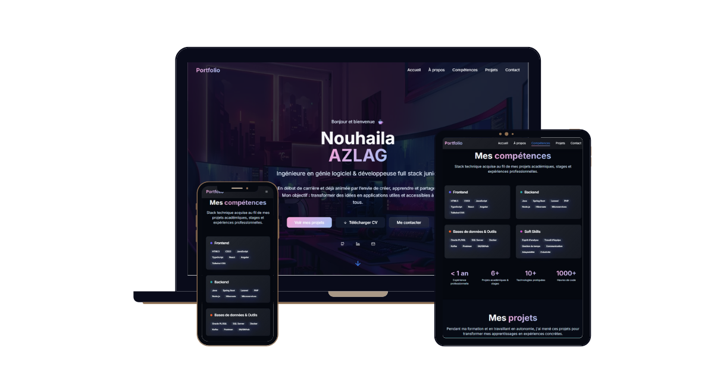

# 🌐 Portfolio - Nouhaila AZLAG

Mon portfolio personnel développé avec React, TypeScript et TailwindCSS, présentant mon parcours, mes compétences, mes projets et mes expériences — avec un chatbot IA intégré permettant de poser des questions sur mon parcours.


## ✨ Aperçu



<!-- 👉 [Voir le portfolio en ligne](https://ton-lien-vercel-ou-netlify.com) -->


## 📌 Sections

- **Accueil** : Présentation et liens vers mes réseaux.  
- **À propos** : Parcours académique et professionnel.  
- **Compétences** : Hard et soft skills.  
- **Projets** : Sélection de projets personnels et académiques.  
- **Contact** : Formulaire de contact et coordonnées.
- 💬 **Chatbot IA** : Un assistant intelligent répondant aux questions sur mon parcours, mes compétences et mes expériences. 

## 🧠 Chatbot IA intégré

Le chatbot est connecté à un backend Spring Boot avec Google Gemini API, capable de :
- Identifier la catégorie d’une question (about, skills, experience, projects)
- Fournir une réponse naturelle et personnalisée
- Gérer les salutations, remerciements et questions générales
  
Sur le front, le chatbot est :
- Accessible via un bouton flottant 🤖
- Affiche les messages de l’utilisateur et du bot avec des icônes animées
- Inclut un effet de chargement (“...” animé) pendant le traitement
- Défile automatiquement pour une expérience fluide

## 🛠️ Stack technique

- **Frontend** : React, TypeScript  
- **UI** : TailwindCSS, ShadCN UI, Lucide Icons  
- **Gestion formulaire** : React Hook Form, Zod  
- **Animations** : Tailwind Animate
-  **Backend lié** : Spring Boot + Gemini API


## 🚀 Installation & lancement

Clone le repo :

```bash
git clone https://github.com/NouhailaAZ/portfolio_.git
cd portfolio_
```
Installe les dépendances :

```bash
npm install
```

Lance en développement :

```bash
npm run dev
```


## 📂 Structure du projet
```bash
src/
 ├── assets/         
 ├── components/     
 ├── hooks/          
 ├── lib/            
 ├── pages/           
 ├── schemas/        
 └── App.tsx         
```
---
## 👩‍💻 
👋 Développé par Nouhaila AZLAG
